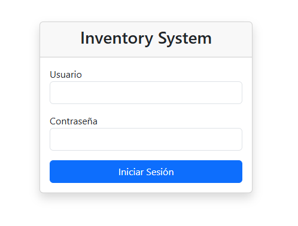
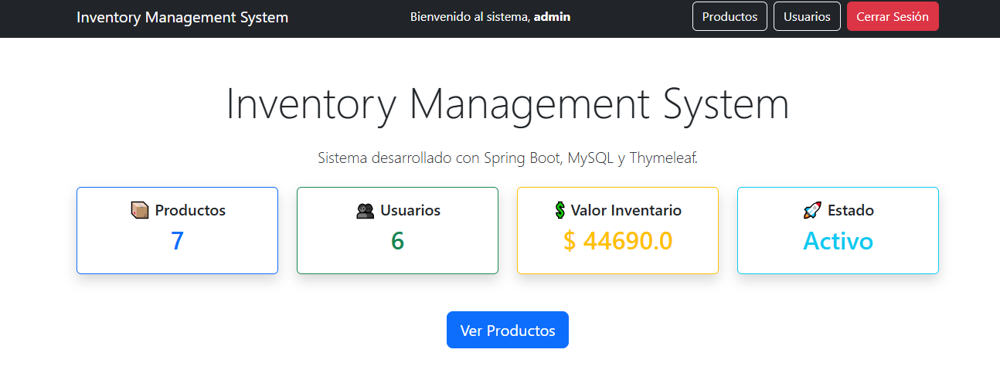
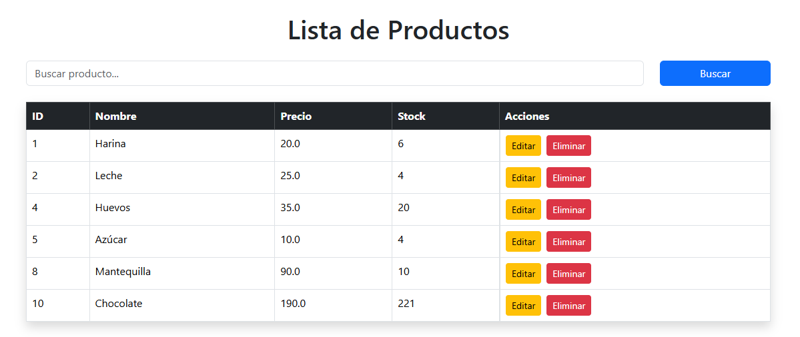
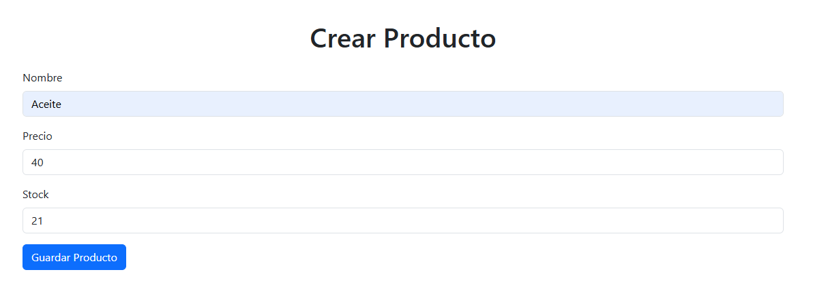
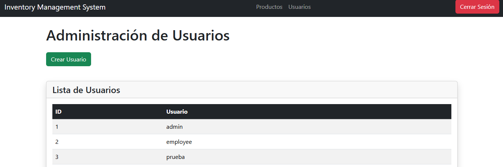
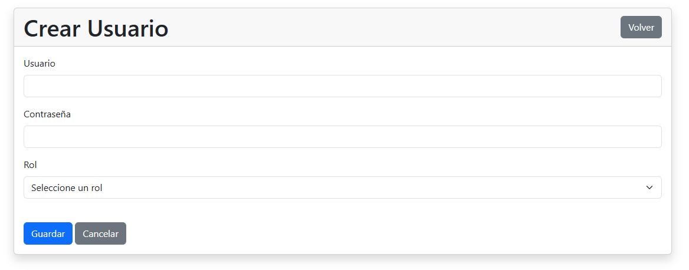

# 📦 Inventory Management System

Sistema web de gestión de inventario desarrollado con **Spring Boot**, **Spring Security**, **Spring Data JPA**, **Thymeleaf** y **MySQL**.

Este proyecto fue desarrollado con el objetivo de demostrar conocimientos en el desarrollo de aplicaciones backend utilizando Java y buenas prácticas de arquitectura MVC.

---

## ✨ Características

- 🔐 Autenticación de usuarios
- 👤 Gestión de usuarios
- 🛡 Roles de usuario (ADMIN / EMPLOYEE)
- 🔑 Contraseñas cifradas con BCrypt
- 📦 CRUD completo de productos
- 🔍 Búsqueda de productos
- ✅ Validaciones de formularios
- 📊 Dashboard con estadísticas
- 🎨 Interfaz responsiva con Bootstrap 5
- 💾 Persistencia de datos con MySQL

---

## 🛠 Tecnologías utilizadas

| Tecnología | Uso |
|------------|-----|
| Java 21 | Lenguaje principal |
| Spring Boot | Framework Backend |
| Spring MVC | Arquitectura MVC |
| Spring Security | Autenticación y autorización |
| Spring Data JPA | Acceso a datos |
| Hibernate | ORM |
| Thymeleaf | Motor de plantillas |
| Bootstrap 5 | Interfaz gráfica |
| MySQL | Base de datos |
| Maven | Gestión de dependencias |
| Git | Control de versiones |

---

# 📷 Capturas del sistema

## Login



---

## Dashboard



---

## Gestión de Productos



---

## Crear Producto



---

## Gestión de Usuarios



---

## Crear Usuario



---

# 🔐 Roles del sistema

## Administrador

Puede:

- Crear productos
- Editar productos
- Eliminar productos
- Crear usuarios
- Administrar usuarios
- Acceder a todas las funciones

---

## Empleado

Puede:

- Consultar productos
- Editar productos
- Buscar productos

No puede:

- Eliminar productos
- Acceder al módulo de usuarios

---

# 🚀 Instalación

## 1. Clonar el repositorio

```bash
git clone https://github.com/TU-USUARIO/inventory-management-system.git
```

## 2. Entrar al proyecto

```bash
cd inventory-management-system
```

## 3. Configurar la base de datos

Crear una base de datos en MySQL.

```sql
CREATE DATABASE inventory;
```

Modificar el archivo:

```
application.properties
```

con tus credenciales:

```properties
spring.datasource.url=jdbc:mysql://localhost:3306/inventory

spring.datasource.username=TU_USUARIO

spring.datasource.password=TU_PASSWORD
```

## 4. Ejecutar la aplicación

```bash
mvn spring-boot:run
```

o desde Visual Studio Code.

---

# 👥 Usuarios de prueba

## Administrador

Usuario

```
admin
```

Contraseña

```
admin123
```

---

## Empleado

Usuario

```
employee
```

Contraseña

```
employee123
```

---

# 📂 Estructura del proyecto

```
src/main/java/com/santiago/inventory
│
├── config
├── controller
├── dto
├── entity
├── model
├── repository
├── service
│
├── resources
│   ├── static
│   ├── templates
│   └── application.properties
│
└── InventoryApplication.java
```

---

# 📈 Funcionalidades implementadas

- Login personalizado
- Gestión de productos
- Gestión de usuarios
- Validaciones
- Búsqueda por nombre
- Dashboard
- Seguridad por roles
- Contraseñas cifradas
- Bootstrap 5
- Arquitectura MVC

---

# 🔮 Mejoras futuras

- Reportes PDF
- Exportación a Excel
- Paginación
- Dashboard con gráficas
- API REST
- Docker
- Despliegue en la nube

---

# 👨‍💻 Autor

**Santiago Zavala Maldonado**

GitHub:

https://github.com/santiagozavm

LinkedIn:

https://www.linkedin.com/in/santiago-zavala-43596a3a7/

---

⭐ Si este proyecto te resulta interesante, no dudes en darle una estrella al repositorio.